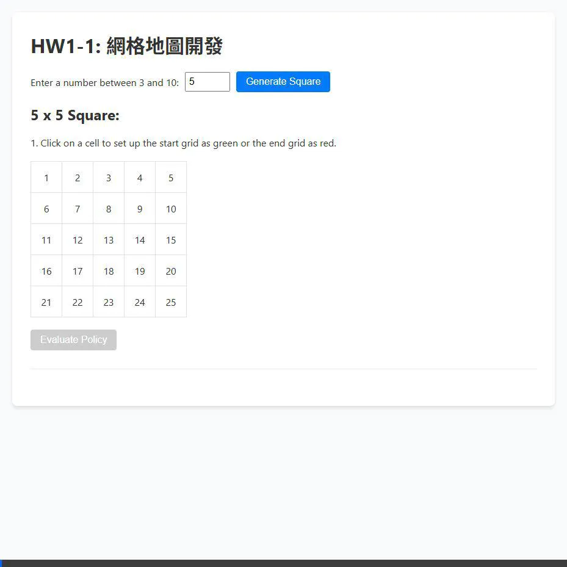

# HW1: Grid Map Development and Policy Evaluation

A web application implementing a Grid Map with Reinforcement Learning Policy Evaluation. 
Developed as part of the Deep Reinforcement Learning course.

🔗 **[Live Demo](#)** *(Add GitHub Pages link here once deployed)*

## ✨ Features
- **Dynamic Grid Sizing**: Support for $n \times n$ grids ($3 \le n \le 10$).
- **Interactive Map Design**: Set Start (Green), End (Red), and Obstacles (Gray) interactively.
- **RL Policy Display**: Random deterministic policies evaluated natively.
- **Value Evaluation**: Computes the Value Matrix $V(s)$ using Policy Evaluation.
- **Modern UI**: Clean and intuitive interface inspired by modern web layouts.

## 🛠️ Tech Stack
- **Python (Flask)**: Backend API handling the Reinforcement Learning mathematics.
- **HTML5**: Page structure.
- **CSS3**: Layout and cell styling.
- **JavaScript**: Frontend interaction and responsive grid rendering.
- **Math Logic**: Standard Policy Evaluation with $\gamma = 0.9$ and $-1$ penalty for bouncing.

## 📸 Preview

---
*Created and deployed with the assistance of Antigravity AI.*
