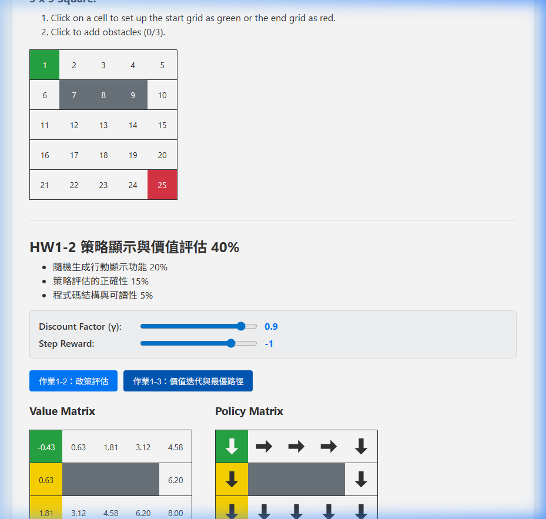
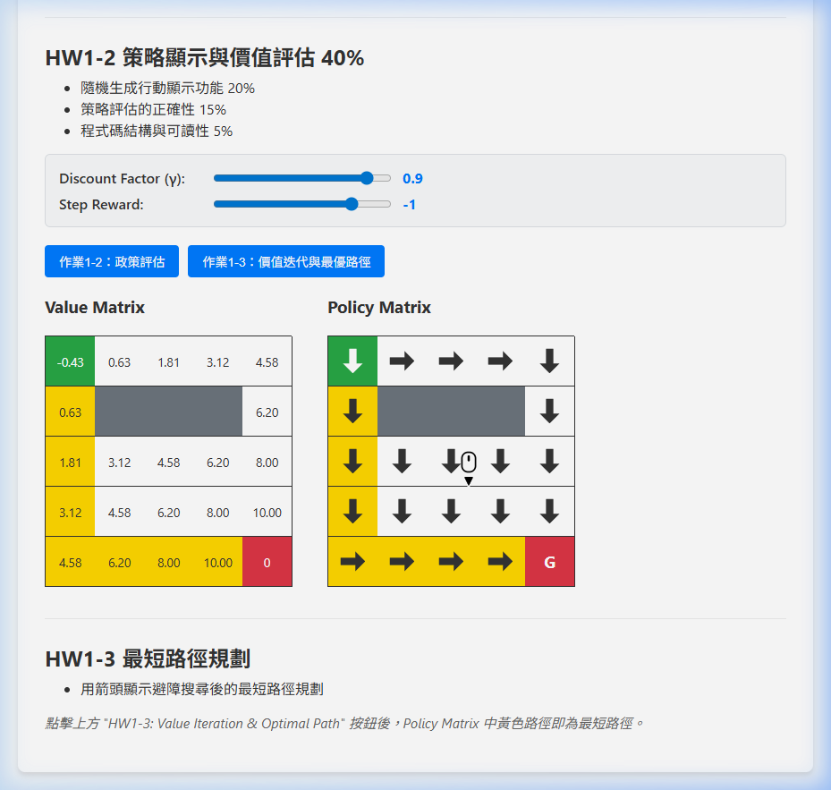

# HW1: Grid Map Development, Policy Evaluation & Shortest Path

A web application implementing a Grid Map with Reinforcement Learning Policy Evaluation and Value Iteration for Shortest Path Planning.  
Developed as part of the Deep Reinforcement Learning course.

🔗 **[Live Demo](https://v901203.github.io/-0304DRL_HW1/)**

---

## ✨ Features

### HW1-1: 網格地圖開發 (60%)
- **Dynamic Grid**: Support for $n \times n$ grids ($3 \le n \le 10$).
- **Interactive Map**: Click to set Start (Green), End (Red), and Obstacles (Gray).
- **Toggle Support**: Click again to remove Start / End / Obstacle.

### HW1-2: 策略顯示與價值評估 (40%)
- **Random Policy**: Generates a random deterministic policy.
- **Policy Evaluation**: Evaluates the policy and computes the Value Matrix $V(s)$.
- **Parameter Tuning**: Adjustable Discount Factor ($\gamma$) and Step Reward via sliders.

### HW1-3: 最短路徑規劃
- **Value Iteration**: Finds optimal values for all states.
- **Optimal Policy**: Extracts the best action per state via argmax.
- **Shortest Path Visualization**: Yellow-highlighted cells with SVG arrows trace the optimal path from Start to Goal, avoiding obstacles.

---

## 🛠️ Tech Stack
- **HTML5**: Page structure and semantic layout.
- **CSS3**: Grid styling, path highlighting, and responsive design.
- **JavaScript**: Full client-side RL computation (Policy Evaluation & Value Iteration).

---

## 📸 Preview

### HW1-1 Grid Map & HW1-3 Value Iteration Results

### HW1-3 Shortest Path with Arrow Visualization

---

## 🔧 How to Use

1. Enter a grid size (3–10) and click **Generate Square**.
2. Click a cell to set the **Start** (green), then the **End** (red), then **Obstacles** (gray).
3. Click **HW1-2: Policy Evaluation** to evaluate a random policy.
4. Click **HW1-3: Value Iteration & Optimal Path** to find the shortest path.
5. The **yellow path** in the Policy Matrix shows the optimal route avoiding obstacles.

---

*Created and deployed with the assistance of Antigravity AI.*
